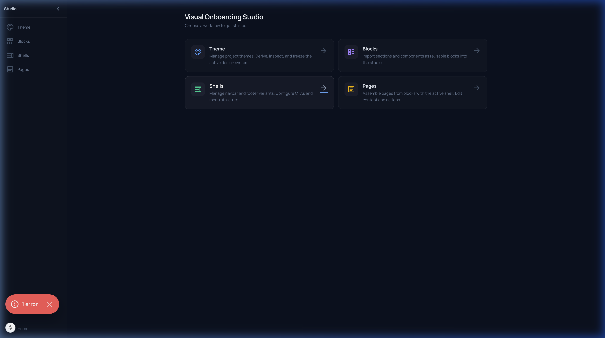
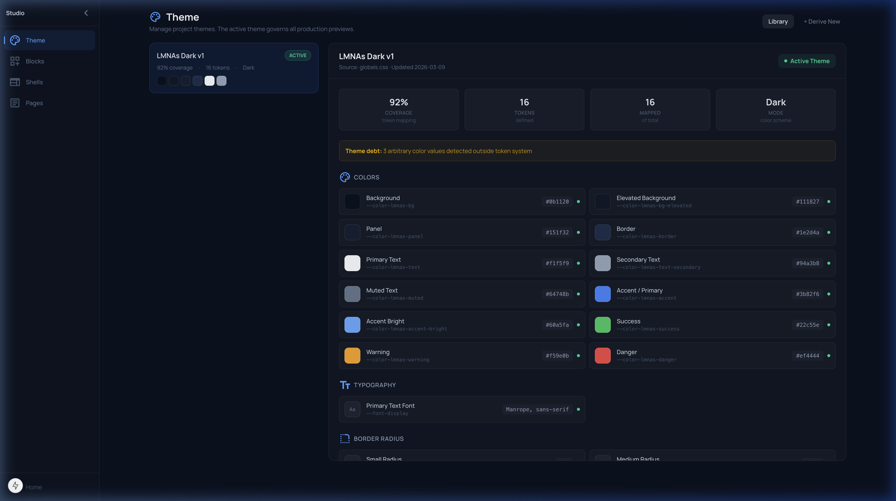
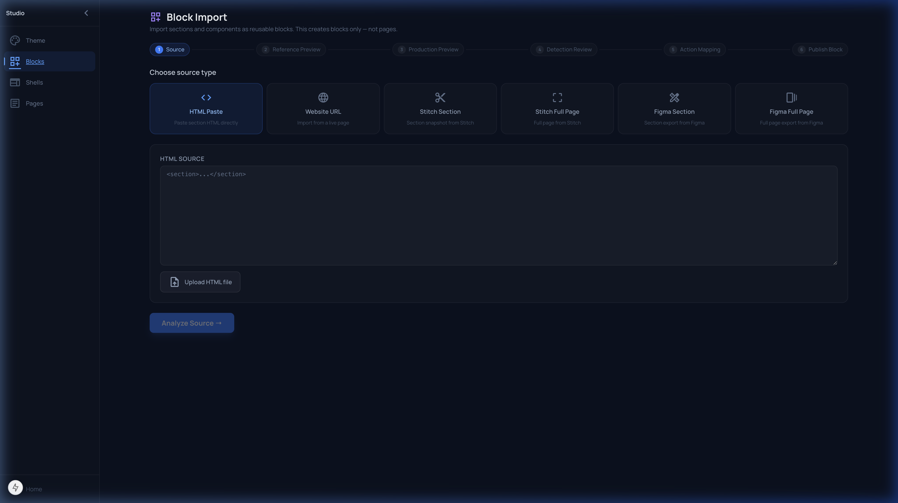
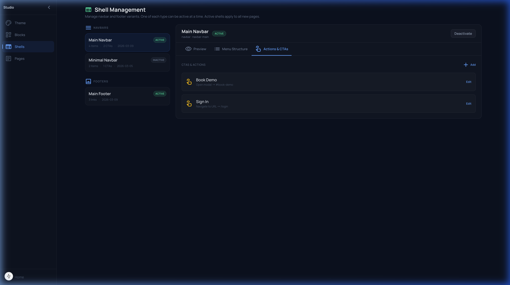
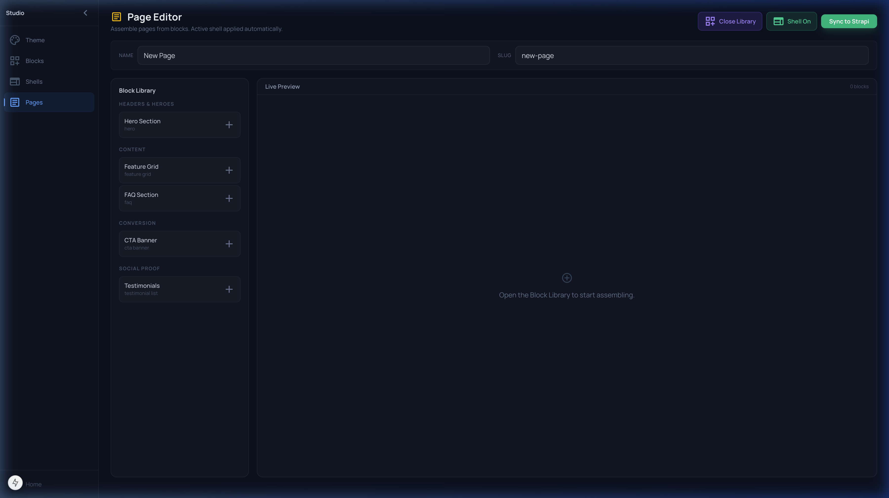

# LMNAs Onboarding Studio — 4-Workflow Completion Pass

## 1. Issues Fixed From Review

| Review Point | Fix Applied |
|---|---|
| Theme: only creation mode | Added Library/Browse mode with theme cards, detail inspection |
| Theme: can't view existing themes | Full theme library with status, tokens, coverage, debt |
| Block Import: page slug still present | Removed entirely — no page slug anywhere |
| Block Import: dropdown for source | Replaced with 6 visual icon + text cards |
| Block Import: upload disappeared | Restored "Upload HTML file" button |
| Shell: can't browse all shells | Navbar/footer grouping with selection |
| Shell: no action config | Tabbed detail with "Actions & CTAs" tab, inline editing, add |
| Page: cramped dual-pane | Full-width preview, collapsible library drawer |
| Page: no content editing | Content inspector panel with field editing |
| Page: no action config | Page-level action overrides in inspector |
| Overall: outdated heavy framing | Refined white/opacity surfaces, lighter borders, calmer spacing |

---

## 2. UI/UX Changes

- **Sidebar**: Slimmer (200px), lighter framing, minimal active indicators
- **Dashboard**: Refined cards with subtle hover states
- **Step Indicator**: Smaller + lighter pill-style steps
- **Preview Pane**: Thinner header, darker frame bg
- **Fidelity Display**: Compact 3-column grid, smaller text

---

## 3. File-by-File Summary

| File | Change |
|---|---|
| `apps/site/app/platform/onboarding/theme/page.tsx` | Full rewrite: Library + Derive modes, token inspection by category, active theme badge, theme switching with regression warning |
| `apps/site/app/platform/onboarding/blocks/page.tsx` | Full rewrite: visual source cards (6 icons), no page slug, file upload, one-block-at-a-time detection, one-action-at-a-time mapping with parent block context |
| `apps/site/app/platform/onboarding/shells/page.tsx` | Full rewrite: navbar/footer grouping, tabbed detail (Preview, Menu Structure, Actions), inline action editing/adding, activate/deactivate |
| `apps/site/app/platform/onboarding/pages/page.tsx` | Full rewrite: full-width preview, collapsible block library drawer, grouped blocks, content inspector, action config with page-level overrides, shell toggle, block order strip with reorder/remove |
| `apps/site/app/platform/onboarding/_components/StudioSidebar.tsx` | Slimmer, lighter framing, consistent styling |
| `apps/site/app/platform/onboarding/layout.tsx` | Explicit dark bg, tighter padding |
| `apps/site/app/platform/onboarding/page.tsx` | Refined dashboard cards, updated descriptions |
| `apps/site/app/platform/onboarding/_components/StepIndicator.tsx` | Lighter pill styling |
| `apps/site/app/platform/onboarding/_components/PreviewPane.tsx` | Thinner header, consistent opacity styling |
| `apps/site/app/platform/onboarding/_components/FidelityDisplay.tsx` | Compact 3-col grid, smaller typography |

---

## 4. Verification Screenshots

### Dashboard

### Theme Workflow — Library with Token Inspection

### Block Import — Visual Source Cards

### Shell Management — Actions & CTAs

### Page Editor — Grouped Block Library

---

## 5. Remaining Gaps

| Gap | Reason |
|---|---|
| Theme API route for Strapi persistence | Requires backend endpoint — scaffolded with localStorage for now |
| Block Import Strapi publish | Already wired to existing API route; works when Strapi is running |
| Page Workflow Strapi sync | Sync button present; needs backend endpoint to persist assembled page |
| Shell import from source | Shells are managed manually; import from HTML source is a future addition |
